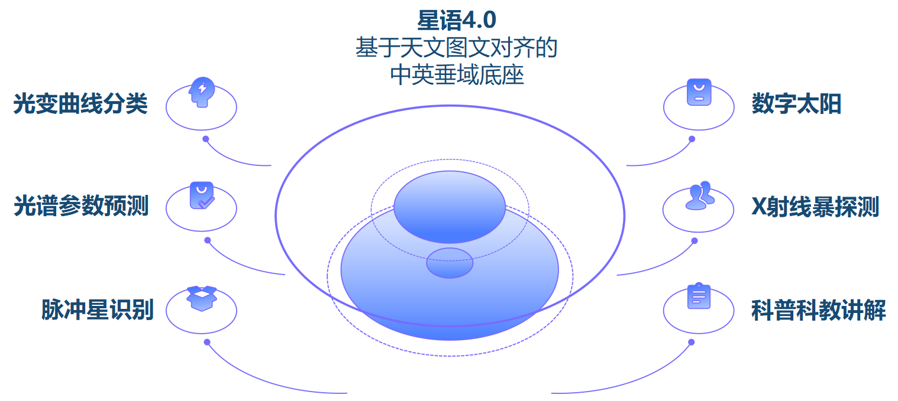
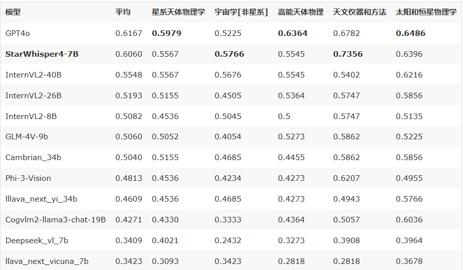
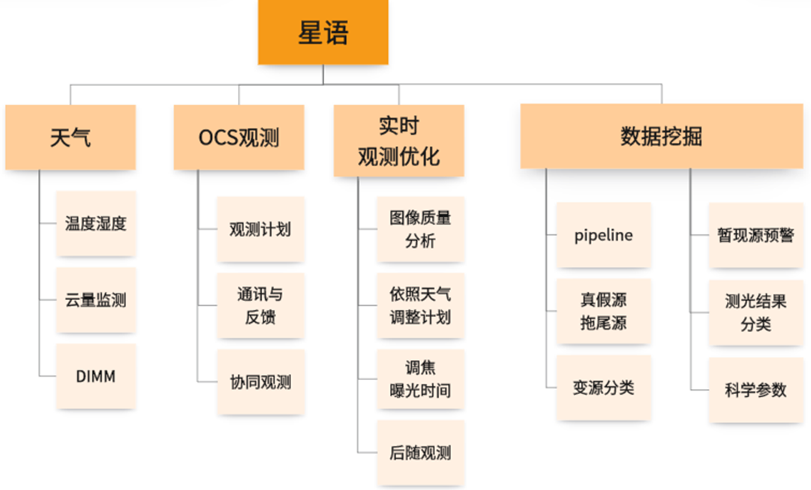

# 星语StarWhisper

🤖 <a href="https://www.modelscope.cn/models/AstroYuYang/StarWhisper4">多模态模型权重</a>
🥳 <a href="https://www.liblib.art/modelinfo/f188f72645024f82bd114344cf82474f">星语绘卷权重</a>

[](https://github.com/Yu-Yang-Li/StarWhisper/stargazers)
[](LICENSE)
[](https://github.com/Yu-Yang-Li/StarWhisper/commits/main)


在国家天文台-之江实验室的支持下，我们开发了StarWhisper4天文大模型系列，包括语言模型、时序模型、多模态模型（7B-72B）。 

## 版本更新：

1.通过清洗订正科普、科研数据飞轮得到的数据，改进训练方法，进一步提升了模型的天文物理、代码与Agent能力，开源了星语3训练集于LLM_Data目录，开源了星语4多模态模型权重于魔搭平台。

2.发布了[StarWhisper LC](https://arxiv.org/abs/2404.10757)的技术报告，一种SOTA的基于迁移学习、大模型的光变曲线分类方法，上传了论文相关测试代码。

3.发布了[StarWhisper Telescope](https://arxiv.org/pdf/2412.06412)的技术报告，一种基于大模型智能体的望远镜控制工作流，已应用于近邻星系巡天项目。

## 效果展示

<div align=center></div>


<div align=center></div>


## 快速使用

下面是一个使用StarWhisper4模型，进行多轮对话交互的样例：

```python
from transformers import Qwen2VLForConditionalGeneration, AutoTokenizer, AutoProcessor
from qwen_vl_utils import process_vision_info
from modelscope import snapshot_download
model_dir = snapshot_download("AstroYuYang/StarWhisper4")

# default: Load the model on the available device(s)
model = Qwen2VLForConditionalGeneration.from_pretrained(
    model_dir, torch_dtype="auto", device_map="auto"
)

# We recommend enabling flash_attention_2 for better acceleration and memory saving, especially in multi-image and video scenarios.
# model = Qwen2VLForConditionalGeneration.from_pretrained(
#     model_dir,
#     torch_dtype=torch.bfloat16,
#     attn_implementation="flash_attention_2",
#     device_map="auto",
# )

# default processer
processor = AutoProcessor.from_pretrained(model_dir)

# The default range for the number of visual tokens per image in the model is 4-16384. You can set min_pixels and max_pixels according to your needs, such as a token count range of 256-1280, to balance speed and memory usage.
# min_pixels = 256*28*28
# max_pixels = 1280*28*28
# processor = AutoProcessor.from_pretrained(model_dir, min_pixels=min_pixels, max_pixels=max_pixels)

messages = [
    {
        "role": "user",
        "content": [
            {
                "type": "image",
                "image": "https://qianwen-res.oss-cn-beijing.aliyuncs.com/Qwen-VL/assets/demo.jpeg",
            },
            {"type": "text", "text": "Describe this image."},
        ],
    }
]

# Preparation for inference
text = processor.apply_chat_template(
    messages, tokenize=False, add_generation_prompt=True
)
image_inputs, video_inputs = process_vision_info(messages)
inputs = processor(
    text=[text],
    images=image_inputs,
    videos=video_inputs,
    padding=True,
    return_tensors="pt",
)
inputs = inputs.to("cuda")

# Inference: Generation of the output
generated_ids = model.generate(**inputs, max_new_tokens=128)
generated_ids_trimmed = [
    out_ids[len(in_ids) :] for in_ids, out_ids in zip(inputs.input_ids, generated_ids)
]
output_text = processor.batch_decode(
    generated_ids_trimmed, skip_special_tokens=True, clean_up_tokenization_spaces=False
)
print(output_text)

```

## 司天工程

司天工程是我国天文学家面向时域天文学所提出的“十五五”天文重大基础设施，一期计划在国内多个优选观测台址布置54台（18组）口径1米级的大视场望远镜，组成多波段同时监测网络，每30分钟完成1万平方度天区的高精度三色“凝视”巡天。司天的采样频率比全球其它巡天项目高近两个量级，将突破目前探测时标的限制，在新的空域和时域下发现大批新天体、新现象，在宇宙极端高能爆发源、引力波电磁对应体、系外行星和太阳系天体等理论和观测研究中形成新的突破，在“两暗一黑三起源”等重大科学问题研究以及地球文明灾难预警等国家空间安全问题方面发挥重要作用。

<div align=center></div>

其中司天"大脑"作为数据智能处理中枢，需要适配于天文的AI工具。StarWhisper作为其备选方案，在使用大模型整合天文知识的同时，探索多模态解决具体天文问题的可能性。
## 许可证信息

项目源码遵从Apache-2.0 license，Qwen1.5-14B Chat的模型权重使用需遵从相应许可。

## To do list

<div align=center></div>


### 大语言模型（科普方式）

- 调整监督微调中，通用数据和专业数据的比例，缓解灾难性遗忘问题。
- 通过人工反馈的强化学习，进一步提升模型性能。
- 通过特定数据集微调，提升模型总结能力，进一步适配知识库。
- 完成天文知识图谱，与模型链接，进一步降低天文领域的幻觉现象。

### 专业多模态（科研工具）

- 开源在多模态微调权重。
- 进一步探索多模态模型在天文图像生成与识别上应用的可能性。


### 观测Agent（司天大脑）

- 提升模型在天文领域的编程能力。
- 在MiniSiTian/司天样机上，进行与天文环境交互的Agent探索工作。
- 考虑通过工具学习，链接天文专业工具。
- 尝试Agent相关工作，验证作为司天大脑备选方案的可行性。

## 引用
如果这篇工作对你有帮助，请引用：

```BibTeX
@misc{wang2024starwhispertelescopeagentbasedobservation,
      title={StarWhisper Telescope: Agent-Based Observation Assistant System to Approach AI Astrophysicist}, 
      author={Cunshi Wang and Xinjie Hu and Yu Zhang and Xunhao Chen and Pengliang Du and Yiming Mao and Rui Wang and Yuyang Li and Ying Wu and Hang Yang and Yansong Li and Beichuan Wang and Haiyang Mu and Zheng Wang and Jianfeng Tian and Liang Ge and Yongna Mao and Shengming Li and Xiaomeng Lu and Jinhang Zou and Yang Huang and Ningchen Sun and Jie Zheng and Min He and Yu Bai and Junjie Jin and Hong Wu and Chaohui Shang and Jifeng Liu},
      year={2024},
      eprint={2412.06412},
      archivePrefix={arXiv},
      primaryClass={astro-ph.IM},
      url={https://arxiv.org/abs/2412.06412}, 
}
```
## Star History


