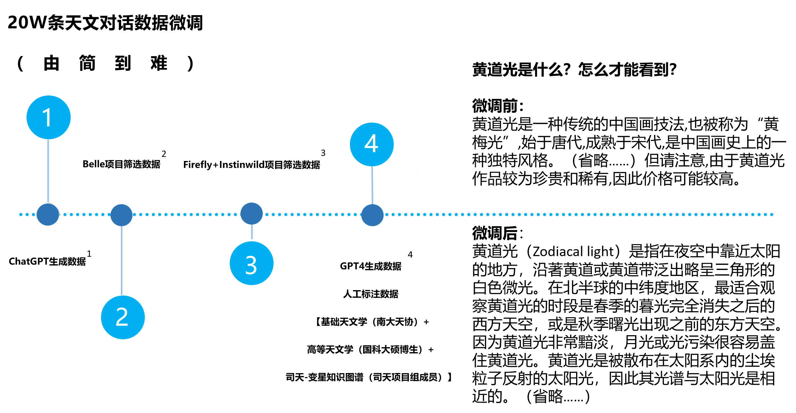
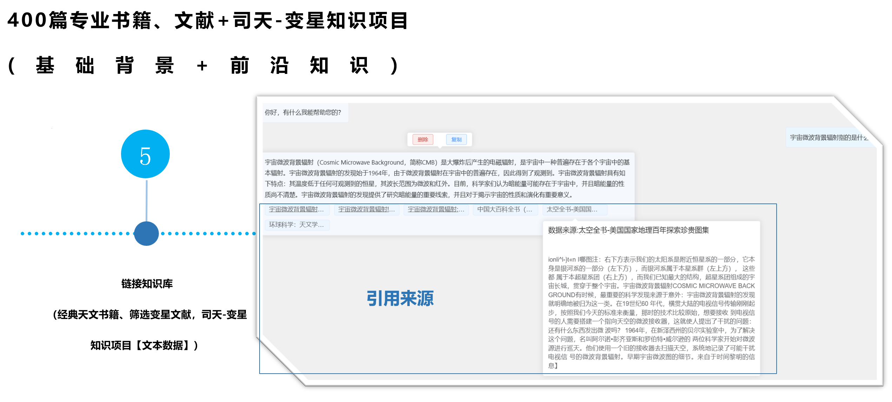
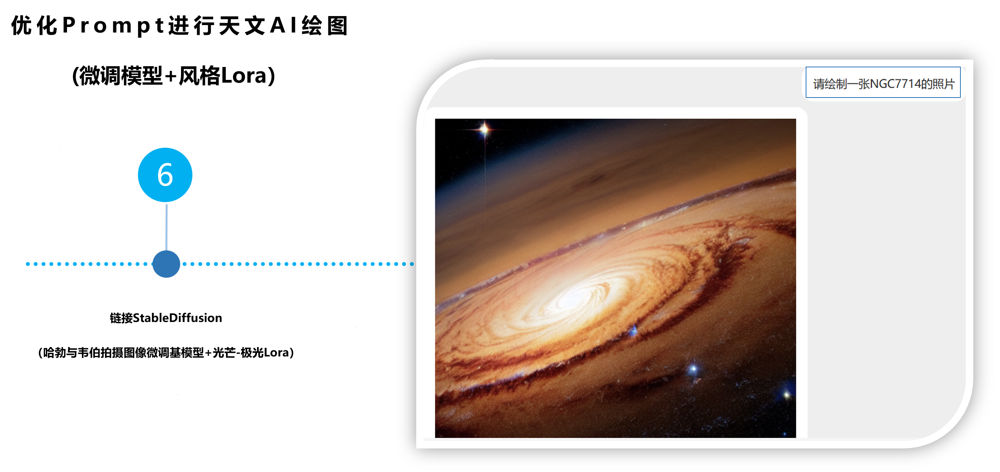
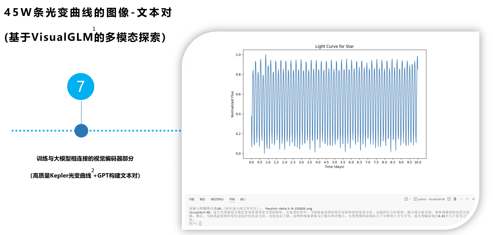
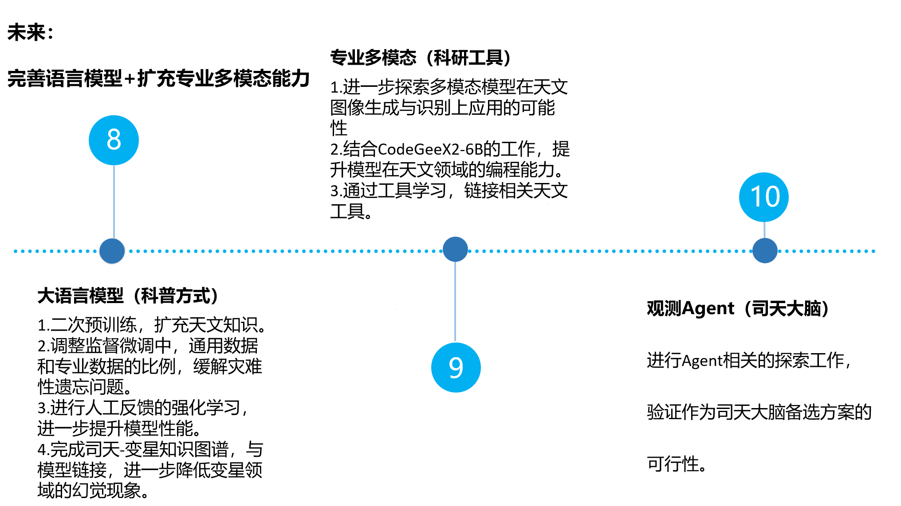

# StarGLM

## 项目描述

我们整合了司天工程相关的语料数据与知识库资料，训练得到了天文大语言模型StarGLM(GLM for Variable Star)。
以期解决大语言模型在部分天文通用知识和前沿变星领域的幻觉现象，为接下来可处理天文多模态任务、部署于望远镜阵列的观测Agent——司天大脑打下基础。

## 功能展示

 

 

 

 

## 安装指南

1.基础模型安装：Checkpoint中存有Lora文件，Model中保存了相应模型，可根据配置条件自行选择合适方式加载，具体可参考ChatGLM2-6B官方教程。
2.链接知识库/StableDiffusion:Wenda(闻达)项目已有非常成熟的实现，基于StarGLM，能够进行多种天文相关的文本处理、知识库筛选等任务。
(注：考虑到版权因素，暂不直接提供知识库文件，部分书单可参考example/books，感谢沈长安（一只张秀）同学提供)
3.多模态探索（VisualGLM权重）：还在进一步完善，包括对数据集的进一步清洗和等待基于ChatGLM2的版本，后续会开源相关权重。
## 许可证信息

项目源码遵从Alpaca 2.0，ChatGLM2-6b的模型权重使用需遵从相应许可。

## 使用/推荐的相关项目

- [ChatGLM2-6B](https://github.com/thudm/chatglm2-6b)
- [Wenda](https://github.com/wenda-LLM/wenda)
- [VisualGLM-6B](https://github.com/THUDM/VisualGLM-6B)
- [ChatGLM-Efficient-Tuning](https://github.com/hiyouga/ChatGLM-Efficient-Tuning)
- [BelleGroup](https://huggingface.co/BelleGroup)
- 
## To do list

### 大语言模型（科普方式）

- [ ]  二次预训练，扩充天文知识。
- [ ]  调整SFT中，通用数据和专业数据的比例，缓解灾难性遗忘问题。
- [ ]  RLHF，进一步提升模型性能。
- [ ]  完善司天-变星知识图谱，与模型链接，进一步降低变星领域的幻觉问题。

### 专业多模态（科研工具）

- [ ]  继续训练输入/输出视觉编码器/解码器，提升在天文专业领域的多模态能力。
- [ ]  结合CodeGeeX2工作，提升模型在天文领域的编程能力。
- [ ]  考虑通过工具学习，链接相关天文工具。

### 观测Agent（司天大脑）

- [ ]  紧跟Agent相关工作，验证作为司天大脑备选方案的可行性。
