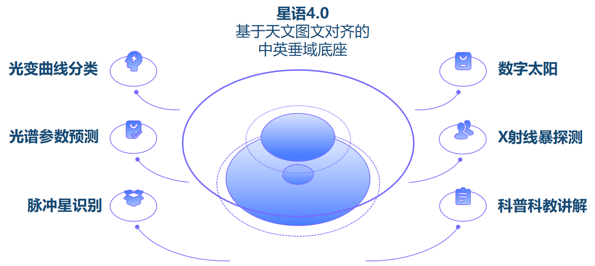
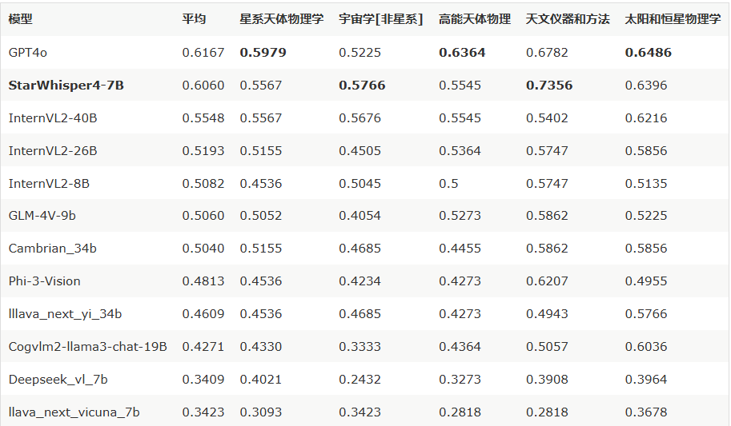
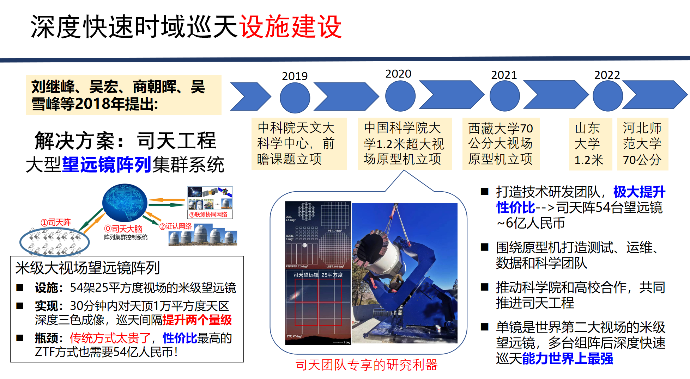

# 星语 5.0 / StarWhisper

[](https://github.com/Yu-Yang-Li/StarWhisper/stargazers)
[](LICENSE)
[](https://github.com/Yu-Yang-Li/StarWhisper/commits/main)

<p align="center">
  中文 &nbsp;|&nbsp; <a href="README_EN.md">English</a>
</p>

**StarWhisper** 是面向天文学和 AI4S 的开源模型与智能体项目。在中国科学院国家天文台、之江实验室等单位支持下，项目从天文学语言模型、时序模型、多模态模型，推进到 **StarWhisper Telescope** 和 **Virtual-GOTTA**：让大模型不只回答天文问题，而是接入真实观测任务、台站信息、望远镜状态和实时响应流程，成为服务科教科研的 AI Astrophysicist 工作流。

本页已按《人工智能驱动科教科研》PDF 的主线更新：从“AI 科教科研”到“具身智能望远镜”，再到全球暂现源望远镜数据组网与早期超新星候选预警。

- [Virtual-GOTTA 交互式路线图](https://yu-yang-li.github.io/StarWhisper/virtual-gotta-map.html)
- [PDF / PPT 来源说明](https://yu-yang-li.github.io/StarWhisper/virtual-gotta-source.html)
- [最新正式论文：StarWhisper Telescope](https://doi.org/10.1038/s44172-025-00520-4)，*Communications Engineering* 4, 184 (2025)

---

## 项目定位

| 方向 | 当前定位 | 仓库对应内容 |
| --- | --- | --- |
| 天文学大语言模型 | 面向科普、科研问答、代码与观测知识的领域模型 | `LLM_Data`、训练数据与模型说明 |
| 时序与多模态模型 | 面向光变曲线、脉冲星识别、天文图像理解等任务 | StarWhisper LC、StarWhisper Pulsar、示例图像 |
| StarWhisper Telescope | 面向端到端天文观测自动化的 agent 框架 | `NGSS` 近邻星系巡天项目代码 |
| Virtual-GOTTA | 面向科学级望远镜的具身智能改造与观测工作流组网 | `docs/virtual-gotta-map.html`、路线图与来源说明 |

StarWhisper 的核心目标不是单点模型展示，而是把天文学知识、数据处理、观测计划、望远镜控制和实时科学判断接到同一套可扩展智能体工作流里。

---

## Virtual-GOTTA：AI 驱动的虚拟司天工程

PDF 中的 Virtual-GOTTA 把 StarWhisper Telescope 进一步推进为“具身智能望远镜”方向：大模型作为人机交互和任务编排入口，连接警报发布、台站信息、望远镜状态、观测计划、数据回传和实时响应。

核心工作流包括：

1. **警报与科学目标接入**：对接暂现源、超新星早期候选、近邻星系巡天等科学任务。
2. **台站与望远镜状态感知**：统一管理观测站信息、设备可用性、天气和观测窗口。
3. **观测计划与执行闭环**：把模型决策转化为可执行观测计划，并在观测后回收数据和状态。
4. **实时响应与候选筛选**：服务小于 1 天爆发早期候选预警，支持全球暂现源望远镜数据组网。
5. **科教科研平台化**：把 AI 科研助手、虚拟科学家和真实望远镜任务结合，形成可教学、可演示、可复用的 AI4S 案例。

[打开 Virtual-GOTTA 交互式路线图](https://yu-yang-li.github.io/StarWhisper/virtual-gotta-map.html)

---

## 已开源与论文进展

1. **StarWhisper 4.0 数据与训练增强**  
   清洗并扩展科普、科研数据集，改进训练方法，提升天文物理、代码和 agent 能力。StarWhisper 3 训练数据已在 `LLM_Data` 目录开源，4.0 权重将发布到 ModelScope。

2. **[StarWhisper Pulsar](https://openreview.net/pdf?id=8SKgWpZiDL)**  
   面向脉冲星识别的多模态大模型技术报告。

3. **[StarWhisper LC](https://spj.science.org/doi/epdf/10.34133/icomputing.0110)**  
   基于迁移学习和大模型的光变曲线分类方法，论文相关测试代码已上传。

   <div align="center"></div>

4. **[StarWhisper Telescope](https://doi.org/10.1038/s44172-025-00520-4)**  
   正式论文发表于 *Communications Engineering* 4, 184 (2025)。论文提出面向端到端天文观测自动化的 AI agent 框架，并在近邻星系巡天项目中落地。相关代码已在 `NGSS` 目录开源。

   <div align="center"></div>

5. **Virtual-GOTTA / StarWhisper 5.0+**  
   基于《人工智能驱动科教科研》PDF，StarWhisper 5.0+ 面向具身智能望远镜与科学级观测工作流：将大模型、台站网络、望远镜状态、实时观测和科学预警整合为可交互、可扩展的科研智能体系统。

---

## 演示

<div align="center"></div>
<div align="center"></div>

---

## 司天工程

**司天工程** 是中国天文学家提出的大型时域天文基础设施。一期计划在国内多个优秀观测站部署 54 台口径 1 米级大视场望远镜，组成多波段同时监测网络，每 30 分钟完成约 1 万平方度天区的高精度三色“凝视”巡天。

司天工程将用于发现极端高能爆发源、引力波电磁对应体、系外行星、太阳系天体等新天体和新现象，并服务暗物质、黑洞、宇宙起源、行星防御等科学问题。StarWhisper 作为“司天大脑”的候选技术路径，探索如何把大模型、智能体和天文专业工具接入真实观测系统。

<div align="center"></div>

---

## 许可

- 源代码遵循 **Apache-2.0 License**。
- Qwen Chat 等基础模型权重遵循其各自许可协议。

---

## 下一步

### 大语言模型：科学传播与科研助手

- 优化通用数据与专业数据比例，缓解灾难性遗忘。
- 引入人工反馈强化学习，提升模型稳定性与科研可用性。
- 构建天文知识图谱，降低领域幻觉。
- 强化摘要、代码生成、观测任务理解和论文辅助能力。

### 多模态模型：科研工具

- 开源更多多模态微调权重。
- 探索天文图像生成、识别和质量控制任务。
- 连接光变曲线、图像、光谱和文本证据。

### 观测 Agent：司天大脑

- 提升模型在天文领域的编程和工具调用能力。
- 在 MiniSiTian / 司天样机上进行人机交互 agent 验证。
- 接入 ASTROLABE、CASA 等专业工具。
- 验证 StarWhisper 作为“司天大脑”候选方案的可行性。

---

## 引用

如果这项工作对你有帮助，请引用最新正式论文：

```BibTeX
@article{wang2025starwhisper,
  title={StarWhisper Telescope: an AI framework for automating end-to-end astronomical observations},
  author={Wang, Cunshi and Zhang, Yu and Li, Yuyang and Hu, Xinjie and Mao, Yiming and Chen, Xunhao and Du, Pengliang and Wang, Rui and Wu, Ying and Yang, Hang and Li, Yansong and Wang, Beichuan and Mu, Haiyang and Chen, Xiaohan and He, Shunxuan and Mo, Hao and Zhang, Liyue and Du, Lin and Zhao, Yunning and Tian, Jianfeng and Ge, Liang and Mao, Yongna and Li, Shengming and Wang, Zheng and Lu, Xiaomeng and Zou, Jinhang and Huang, Yang and Sun, Ningchen and Zheng, Jie and He, Min and Bai, Yu and Jin, Junjie and Wu, Hong and Liu, Jifeng},
  journal={Communications Engineering},
  volume={4},
  pages={184},
  year={2025},
  doi={10.1038/s44172-025-00520-4},
  url={https://doi.org/10.1038/s44172-025-00520-4}
}
```

## Star History


