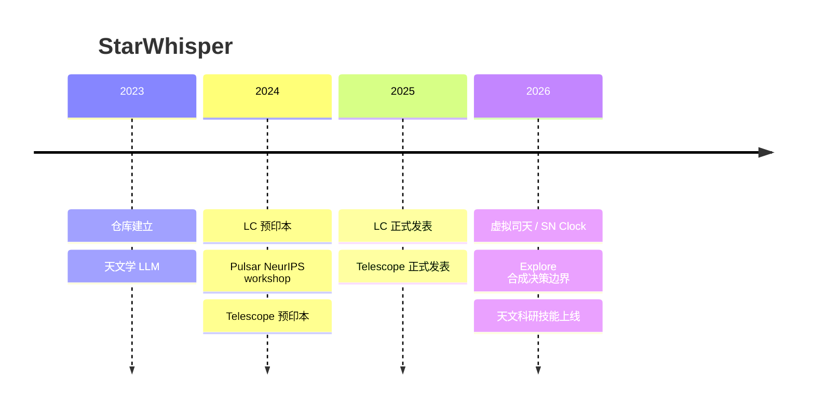

# 星语 / StarWhisper

[](https://github.com/Yu-Yang-Li/StarWhisper/stargazers)
[](LICENSE)
[](https://doi.org/10.1038/s44172-025-00520-4)
[](https://github.com/Yu-Yang-Li/StarWhisper/commits/main)

<p align="center">
  中文 &nbsp;|&nbsp; <a href="README_EN.md">English</a>
</p>

<div align="center">


</div>

**StarWhisper** 从天文学语言模型做起，再接到光变曲线、脉冲星候选、真实望远镜观测，再到 2026 年的虚拟司天（SN Clock）和可回放决策边界。项目由国家天文台、之江实验室等单位支持。最新正式论文是 2025 年 11 月的 [StarWhisper Telescope](https://doi.org/10.1038/s44172-025-00520-4)。

| 现在从哪进 | 对应阶段 |
| --- | --- |
| [`LLM_Data/`](LLM_Data) | 2023–2024 语言模型数据 |
| [`StarWhisper_LC/`](StarWhisper_LC) · [Pulsar 报告](https://openreview.net/pdf?id=8SKgWpZiDL) | 2024–2025 时序与多模态 |
| [`NGSS/`](NGSS) · [Telescope 论文](https://doi.org/10.1038/s44172-025-00520-4) | 2025 观测自动化 |
| [Virtual-GOTTA 路线图](https://yu-yang-li.github.io/StarWhisper/virtual-gotta-map.html) | 2026 虚拟司天 / SN Clock |
| 下文 Explore · [`skills/`](skills/README.md) | 2026 决策边界与科研技能 |

---

## 时间线


```mermaid
timeline
    title StarWhisper
    2023 : 仓库建立 : 天文学 LLM
    2024 : LC 预印本 : Pulsar NeurIPS workshop : Telescope 预印本
    2025 : LC 正式发表 : Telescope 正式发表
    2026 : 虚拟司天 / SN Clock : Explore 合成决策边界 : 天文科研技能上线
```

| 时间 | 阶段 | 公开产物 |
| --- | --- | --- |
| 2023.07 | 仓库建立 | GitHub `Yu-Yang-Li/StarWhisper` |
| 2023–2024 | 天文学语言模型 | `LLM_Data`（StarWhisper 3 训练数据）；4.0 权重计划发 ModelScope |
| 2024.04 | 光变曲线 | [arXiv:2404.10757](https://arxiv.org/abs/2404.10757) |
| 2024.12 | 脉冲星候选 | NeurIPS 2024 FM4Science：[StarWhisper-Pulsar](https://openreview.net/pdf?id=8SKgWpZiDL) |
| 2024.12 | 观测自动化预印本 | [arXiv:2412.06412](https://arxiv.org/abs/2412.06412) |
| 2025.02 | 光变曲线正式发表 | [Intelligent Computing](https://spj.science.org/doi/10.34133/icomputing.0110) |
| 2025.11 | 望远镜 agent 正式发表 | [Communications Engineering 4, 184](https://doi.org/10.1038/s44172-025-00520-4)；代码 `NGSS` |
| 2026 | 虚拟司天 / SN Clock | 工作在 snclock 仓库；公开地图见 [Virtual-GOTTA](https://yu-yang-li.github.io/StarWhisper/virtual-gotta-map.html) |
| 2026 | 决策边界 | StarWhisper-Explore-v0.2（合成环境，稳定负结果） |
| 2026.08 | 科研技能 | [`skills/`](skills/README.md)，天文默认值（ADS / astro-ph / AAS） |

<div align="center">


</div>

<p align="center"><sub>现在的工作面：模型、望远镜 agent、Virtual-GOTTA 与科研技能叠在同一条线上，不是四套互不相干的 demo。</sub></p>

---

## 2023–2024 · 天文学语言模型

先做能回答天文问题、写代码、读观测知识的领域模型。StarWhisper 3 的训练数据在 `LLM_Data`。4.0 继续清洗科普与科研数据，权重计划发布到 ModelScope。

这一阶段解决的是“模型懂不懂天文”，还没有接到望远镜控制。

---

## 2024–2025 · 光变曲线与脉冲星

把模型从问答推到时序和多模态数据。

**2024 年 4 月**，[StarWhisper LC](https://arxiv.org/abs/2404.10757) 预印本上线；**2025 年 2 月 26 日**正式发表于 *Intelligent Computing*。用 Kepler / K2 光变曲线做变星分类，并给出一组少做手工特征的 LLM / 多模态 / 音频模型。测试代码在仓库里。

<div align="center">


</div>

**2024 年 12 月**，[StarWhisper-Pulsar](https://openreview.net/pdf?id=8SKgWpZiDL) 在 NeurIPS 2024 FM4Science workshop 报告：用多模态大模型做脉冲星候选分类。

---

## 2025 · StarWhisper Telescope

**2024 年 12 月**预印本，**2025 年 11 月 6 日**发表于 *Communications Engineering*。[论文](https://doi.org/10.1038/s44172-025-00520-4)给出端到端观测自动化 agent，并在近邻星系巡天（NGSS）网络落地。代码在 [`NGSS/`](NGSS)。

夜前计划几乎从不会原样执行。临时科学目标会插入，短时天气会关掉窗口，跟踪、调焦、相机或穹顶也可能突然异常。系统必须连续决定：继续、插入、延后、安全暂停，还是恢复后重规划。

<div align="center">


</div>

<div align="center">


</div>

<p align="center"><sub>图 1. 既定计划、三类扰动、观测智能体与受约束行动。</sub></p>

<div align="center">


</div>
<div align="center">


</div>

这一阶段证明的是：agent 可以接到真实巡天流程。它还没有回答“判断在什么条件下值得信任”。

---

## 2026 · 虚拟司天（SN Clock）

2026 年才把司天做成可运行的虚拟系统。这条线的代码在 **snclock**（SN Clock）仓库：用大模型编排警报、台站状态、观测计划和数据回传，早期科学应用是超新星时钟——估计爆发时刻、筛年轻超新星候选。本仓库里的公开说明是 [Virtual-GOTTA 路线图](https://yu-yang-li.github.io/StarWhisper/virtual-gotta-map.html)。

**司天工程**计划在国内多个台站部署 54 台 1 米级大视场望远镜，约每 30 分钟完成 1 万平方度的三色巡天。StarWhisper 是“司天大脑”的一条候选路径。2025 年 Telescope 论文证明的是真实巡天里的观测 agent；虚拟司天 / SN Clock 是次年的工作，不要写成同一年已经做完。

<div align="center">


</div>

---

## 2026 · 决策边界（StarWhisper-Explore）

真实栈已经能跑自动观测。Explore 问的是下一句：**在什么条件下这个判断值得信任，会稳定牺牲什么，何时必须拒绝。**

环境版本 `StarWhisper-Explore-v0.2`。固定台站 XingLong，单望远镜，一夜六个时隙；候选目标、暂现源到达、天气和设备扰动由种子生成，策略之间共享同一剧本。Agent 不得读取未来扰动，也不得改安全阈值。真实硬件联锁的优先级高于任何建议动作。

这是**合成决策闭环**，用来研究策略，不是光学传播仿真，也不是真实硬件闭环。公开材料不包含望远镜凭据、FTP/MQTT 地址和未脱敏图像。

比较对象预先固定为四类：无干预、随机、确定性优先级、规则 Agent。预注册的正向门槛要求：三个种子均无主动安全违规，无效动作率 ≤ 1%，巡天完成度下降不超过 5 个百分点，同时高价值暂现源跟进率相对提高至少 20%，或综合科学效用提高至少 5%。

当前 90 episode / 策略的合成结果：

| 策略 | 平均科学效用 | 巡天完成度 | 高价值暂现源跟进率 | 无效动作 | 被联锁拦截的危险尝试 |
| --- | ---: | ---: | ---: | ---: | ---: |
| 无干预 | 3.9343 | 77.41% | 0.00% | 0 | 122 |
| 随机 | 2.4027 | 30.19% | 30.37% | 18 | 72 |
| 确定性优先级 | 4.3289 | 61.11% | 49.81% | 0 | 0 |
| 规则 Agent | 4.3996 | 51.67% | 73.33% | 0 | 0 |

<div align="center">


</div>

<p align="center"><sub>图 2. 预注册门槛下的策略权衡：规则 Agent 跟进率最高，但落在巡天完成度允许区左侧。</sub></p>

规则 Agent 相对确定性优先级把跟进率提高了 23.52 个百分点，科学效用只提高约 1.6%，但巡天完成度下降 9.44 个百分点，超过预注册的 5 个百分点容忍线。这是**稳定负结果**：当前边际价值规则过度偏向短期响应。三个种子方向一致，双跑输出哈希一致。它不能写成“Agent 已经赢了”。

<div align="center">


</div>

<p align="center"><sub>图 3. 先证明可复现，再校准现实，最后才进入只建议、不执行的硬件影子运行。</sub></p>

下一步：补上 AstroQ / TJO 风格的约束调度 baseline，用脱敏日志校准扰动频率，再把同一决策接口接到观测时序模型、短时气象和控制模型。影子运行仍然是建议，不是放权。

---

## 2026 · 天文科研技能

2026 年 8 月，从 [tashan-research-skills](https://github.com/TashanGKD/tashan-research-skills) 选出 13 个技能做天文适配后放进 [`skills/`](skills/README.md)。默认值改成 NASA ADS、arXiv `astro-ph`、AAS 引用、光变/光谱/FITS 数据合同，以及“合成 / 回放 / 硬件”三条边界。

<div align="center">


</div>

| 类 | 技能 |
| --- | --- |
| 文献证据 | 论文检索 · 深度研究 · 论文审查 |
| 研究构思 | 假设生成 · 数据处理 · 实验设计 · 统计分析 |
| 成果表达 | 文本润色 · 学术写作 · 科研绘图 · PPT |
| 协作沉淀 | 引用合规 · 科研画像 |

```powershell
git clone https://github.com/Yu-Yang-Li/StarWhisper.git
Copy-Item -Recurse .\StarWhisper\skills\giiisp-paper-search-apis "$env:USERPROFILE\.codex\skills\giiisp-paper-search-apis"
```

没有 ADS / Giiisp 密钥时走 dry-run 或本地回退，不伪造检索命中。技能不能对望远镜下发指令。

---

## 使用边界

| 可以说 | 不可以说 |
| --- | --- |
| 2025 年论文描述的观测自动化框架已在 NGSS 落地 | 本仓库已经接管真实望远镜的安全联锁 |
| Explore-v0.2 的合成夜次可复现、哈希一致 | 规则 Agent 已经通过正向发现门槛 |
| 技能能辅助 ADS 检索、写作和引用检查 | 技能输出等于已发表结果或已发现暂现源 |
| 影子运行可以给出建议 | 建议已被硬件执行 |

源代码：**Apache-2.0**。`skills/` 中改编自他山科研技能库的部分见 [`skills/NOTICE.md`](skills/NOTICE.md)，遵循 MIT。基础模型权重遵循各自许可证。

---

## 引用

如果这项工作对你有帮助，请引用 Telescope 正式论文：

```BibTeX
@article{wang2025starwhisper,
  title={StarWhisper Telescope: an AI framework for automating end-to-end astronomical observations},
  author={Wang, Cunshi and Zhang, Yu and Li, Yuyang and Hu, Xinjie and Mao, Yiming and Chen, Xunhao and Du, Pengliang and Wang, Rui and Wu, Ying and Yang, Hang and Li, Yansong and Wang, Beichuan and Mu, Haiyang and Chen, Xiaohan and He, Shunxuan and Mo, Hao and Zhang, Liyue and Du, Lin and Zhao, Yunning and Tian, Jianfeng and Ge, Liang and Mao, Yongna and Li, Shengming and Wang, Zheng and Lu, Xiaomeng and Zou, Jinhang and Huang, Yang and Sun, Ningchen and Zheng, Jie and He, Min and Bai, Yu and Jin, Junjie and Wu, Hong and Liu, Jifeng},
  journal={Communications Engineering},
  volume={4},
  pages={184},
  year={2025},
  doi={10.1038/s44172-025-00520-4},
  url={https://doi.org/10.1038/s44172-025-00520-4}
}
```

## Star History

[](https://star-history.com/#Yu-Yang-Li/StarWhisper&Date)
