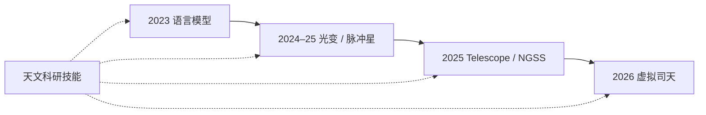

# 星语 / StarWhisper

[](https://github.com/Yu-Yang-Li/StarWhisper/stargazers)
[](LICENSE)
[](https://doi.org/10.1038/s44172-025-00520-4)
[](https://github.com/Yu-Yang-Li/StarWhisper/commits/main)

<p align="center">
  中文 &nbsp;|&nbsp; <a href="README_EN.md">English</a>
</p>

<div align="center">


</div>

StarWhisper 是面向天文学的开源工作，由国家天文台、之江实验室等单位支持。2023 年从天文语言模型做起，随后做到 Kepler / K2 光变分类、脉冲星候选，以及接到近邻星系巡天（NGSS）上的观测 agent。2026 年的主线是虚拟司天（SN Clock）。

最新正式论文是 2025 年 11 月的 [StarWhisper Telescope](https://doi.org/10.1038/s44172-025-00520-4)。仓库按这条时间线组织。


```mermaid
flowchart LR
  A["2023 语言模型"] --> B["2024–25 光变 / 脉冲星"]
  B --> C["2025 Telescope / NGSS"]
  C --> D["2026 虚拟司天"]
  S["天文科研技能"] -.-> A
  S -.-> B
  S -.-> C
  S -.-> D
```

| 年 | 做了什么 | 代码 / 权重 |
| --- | --- | --- |
| 2023 | 仓库建立，天文语言模型 | [`LLM_Data/`](LLM_Data)，[StarWhisper3](https://www.modelscope.cn/models/AstroYuYang/StarWhisper3) |
| 2024 | 光变分类、脉冲星、Telescope 预印本 | [`StarWhisper_LC/`](StarWhisper_LC)，[Pulsar 代码](https://github.com/ACMISLab/StarWhisper-Pulsar) |
| 2025 | LC、Telescope 发表 | [`NGSS/`](NGSS) |
| 2026 | 虚拟司天、Explore、天文技能 | [SitianClaw](https://github.com/Yu-Yang-Li/SitianClaw)，[`skills/`](skills/README.md) |

| 要找什么 | 去哪 | 说明 |
| --- | --- | --- |
| 观测 agent | [`NGSS/`](NGSS) | 论文对应代码；依赖 NINA 等外部服务 |
| 光变分类测试 | [`StarWhisper_LC/`](StarWhisper_LC) | 测试代码，不是完整训练复现 |
| 可跑的技能 | [`skills/`](skills/README.md) | 4 个本线功能技能 + 13 个他山改编；无密钥 dry-run |
| SN Clock 候选表 | [`snclock/`](snclock/README.md) | 22 个源的爆发年龄预测；覆盖范围有限，看数据卡 |
| 虚拟司天 | [地图](https://yu-yang-li.github.io/StarWhisper/virtual-gotta-map.html)，[SitianClaw](https://github.com/Yu-Yang-Li/SitianClaw) | 可运行系统不在本仓库根目录 |
| Explore 数字 | [`explore/`](explore/README.md) | 合成环境规格和已核对结果；环境代码尚未入库 |

---

## 2023–2024 · 语言模型

StarWhisper 3 做天文问答和写代码。训练数据在 [`LLM_Data/`](LLM_Data)，权重在魔搭 [AstroYuYang/StarWhisper3](https://www.modelscope.cn/models/AstroYuYang/StarWhisper3)。4.0 仍在整理科普和科研文本，权重打算放到魔搭。

---

## 2024–2025 · 光变曲线和脉冲星

[StarWhisper LC](https://spj.science.org/doi/10.34133/icomputing.0110) 用 Kepler / K2 光变做变星分类，主要看造父变星、RR Lyrae、食双星等。文里除了 Conv1D–BiLSTM 和 Swin Transformer，还有一组少做手工特征的 LLM / 多模态 / 音频模型，准确率大约 90%。2024 年 4 月预印本，2025 年 2 月 26 日发表于 *Intelligent Computing*。测试代码在 [`StarWhisper_LC/`](StarWhisper_LC)。

<div align="center">


</div>

2024 年 12 月，[StarWhisper-Pulsar](https://openreview.net/pdf?id=8SKgWpZiDL) 在 NeurIPS 2024 FM4Science workshop 报告，用多模态大模型做脉冲星候选分类。代码在 [ACMISLab/StarWhisper-Pulsar](https://github.com/ACMISLab/StarWhisper-Pulsar)。

---

## 2025 · StarWhisper Telescope

[论文](https://doi.org/10.1038/s44172-025-00520-4) 2024 年 12 月预印本，2025 年 11 月 6 日发表于 *Communications Engineering*。观测自动化 agent 接到近邻星系巡天（NGSS）上，大约 10 台业余级望远镜。代码在 [`NGSS/`](NGSS)。

夜前计划很少能原样执行。临时目标会插进来，天气会关掉窗口，跟踪、调焦、相机或穹顶也可能出问题。系统要反复决定：继续、插入、延后、安全暂停，还是恢复后重规划。

<div align="center">


</div>

<p align="center"><sub>既定计划、三类扰动、观测智能体、受约束行动与反馈。这是 Telescope 与 Explore 共用的判断结构，不是光学仿真，也不是真实硬件截图。</sub></p>

<div align="center">


</div>

---

## 2026 · 虚拟司天

2026 年才把虚拟司天做成可运行的系统（SN Clock）。早期科学应用是超新星时钟：估计爆发时刻、筛年轻超新星候选。公开说明见 [Virtual-GOTTA 地图](https://yu-yang-li.github.io/StarWhisper/virtual-gotta-map.html)。同一套工作流的可安装技能在 [SitianClaw](https://github.com/Yu-Yang-Li/SitianClaw)，真假源样机在 [`GOTTA_Prototype/`](GOTTA_Prototype)。

[`snclock/`](snclock/README.md) 放了一次生产输出：22 个 TNS 源在发现时刻的爆发后年龄估计，给 q16 / q50 / q84 三个分位，按是否落在两天内分两档。其中只有 2 个源连保守口径 q84 都在两天内。这张表的覆盖范围小于声明的筛选窗口，多数行的输入快照也没有留存，具体在数据卡里写清楚了。读表用 [`starwhisper-snclock`](skills/starwhisper-snclock/SKILL.md)：

```powershell
python .\skills\starwhisper-snclock\scripts\screen_snclock.py rank --top 10
python .\skills\starwhisper-snclock\scripts\screen_snclock.py audit
```

年龄估计不是光谱分类，表里的源也都已经在 TNS 上，不构成新发现。

司天计划在国内多个台站放 54 台 1 米级大视场望远镜，大约每 30 分钟扫 1 万平方度、三色。StarWhisper 是“司天大脑”的一条候选路径。

<div align="center">


</div>

同属 2026 年、但独立于虚拟司天主线的还有：

- 兴隆全天相机 [`AllSky-Camera-XL/`](AllSky-Camera-XL)：从原图排到新的观测序列
- 葵花卫星云量临近预报：私有仓库，用 2022–2025 年历史夜次，2026 年 8 月主线已收口，还不是业务预报
- 稀疏 ZTF / ATLAS 光变早期分类：[`Early Classification from Sparse Light Curves/`](Early%20Classification%20from%20Sparse%20Light%20Curves)
- 低信噪比恒星光谱：[`Low-SNR-Stellar-Spectra-as-Language/`](Low-SNR-Stellar-Spectra-as-Language)，独立仓库 [Jared-web03](https://github.com/Jared-web03/Low-SNR-Stellar-Spectra-as-Language)

---

## 2026 · Explore

Telescope 已经能在巡天里自动观测。Explore 看的是这个判断什么时候靠得住、会牺牲什么、什么时候必须停。

规格、动作集合和已核对表在 [`explore/`](explore/README.md)。`StarWhisper-Explore-v0.2` 是合成环境：兴隆、单镜、一夜六个时隙。Agent 看不到未来扰动，也不能改安全阈值。这不是光学仿真，没有接到真实望远镜上，**环境代码也还没有放进本仓库**。

预先比较无干预、随机、确定性优先级和规则 Agent。算正向结果，三个种子都要过：没有主动安全违规，无效动作率 ≤ 1%，巡天完成度掉不超过 5 个百分点，并且高价值暂现源跟进率相对提高至少 20%，或科学效用提高至少 5%。

90 episode / 策略：

| 策略 | 平均科学效用 | 巡天完成度 | 高价值暂现源跟进率 | 无效动作 | 被拦截的危险尝试 |
| --- | ---: | ---: | ---: | ---: | ---: |
| 无干预 | 3.9343 | 77.41% | 0.00% | 0 | 122 |
| 随机 | 2.4027 | 30.19% | 30.37% | 18 | 72 |
| 确定性优先级 | 4.3289 | 61.11% | 49.81% | 0 | 0 |
| 规则 Agent | 4.3996 | 51.67% | 73.33% | 0 | 0 |

<div align="center">


</div>

规则 Agent 相对确定性优先级，跟进率高 23.52 个百分点，效用大约高 1.6%，巡天完成度低 9.44 个百分点，过了预注册的 5 个百分点线。三个种子方向一样，复跑哈希一致。这是稳定的负结果：短期响应换来了过量的巡天欠账。

判定可以自己跑一遍，也可以拿去判自己的实验表：

```powershell
python .\skills\starwhisper-explore\scripts\eval_gate.py bar
python .\skills\starwhisper-explore\scripts\eval_gate.py gate --agent rule_agent
```

<div align="center">


</div>

<p align="center"><sub>先合成环境可复现，再脱敏日志校准，最后才是真实硬件影子运行（只建议、不执行）。当前公开结果停在第一级。</sub></p>

---

## 2026 · 技能

[`skills/`](skills/README.md) 里是**做事的**技能，不是目录导览：每个都有决策规则、可跑脚本和回归测试。

| 技能 | 做什么 |
| --- | --- |
| [`starwhisper-snclock`](skills/starwhisper-snclock/SKILL.md) | 把爆发年龄预测筛成候选清单，并审计证据强度 |
| [`starwhisper-explore`](skills/starwhisper-explore/SKILL.md) | 按预注册门槛逐条判定策略对比 |
| [`starwhisper-night-plan`](skills/starwhisper-night-plan/SKILL.md) | 校验 observe_config、算一夜容量、lint 目标表 |
| [`starwhisper-index`](skills/starwhisper-index/SKILL.md) | 判断该跑哪个技能，还是这条线只有材料可读 |

另有他山改编的 13 个天文科研技能（检索、假设、实验设计、统计、写作、审稿、绘图）。

没有密钥就 dry-run，不编文献。夜计划技能只做检查，任何情况下不碰 `/manipulate_nina` 和 `/ftp_transfer`。

```powershell
powershell -File .\skills\install_native.ps1
python .\skills\starwhisper-night-plan\scripts\plan_night.py budget
python .\skills\giiisp-paper-search-apis\scripts\ads_first_search.py --query "early supernova ZTF" --dry-run
```

---

## 引用

```BibTeX
@article{wang2025starwhisper,
  title={StarWhisper Telescope: an AI framework for automating end-to-end astronomical observations},
  author={Wang, Cunshi and Zhang, Yu and Li, Yuyang and Hu, Xinjie and Mao, Yiming and Chen, Xunhao and Du, Pengliang and Wang, Rui and Wu, Ying and Yang, Hang and Li, Yansong and Wang, Beichuan and Mu, Haiyang and Chen, Xiaohan and He, Shunxuan and Mo, Hao and Zhang, Liyue and Du, Lin and Zhao, Yunning and Tian, Jianfeng and Ge, Liang and Mao, Yongna and Li, Shengming and Wang, Zheng and Lu, Xiaomeng and Zou, Jinhang and Huang, Yang and Sun, Ningchen and Zheng, Jie and He, Min and Bai, Yu and Jin, Junjie and Wu, Hong and Liu, Jifeng},
  journal={Communications Engineering},
  volume={4},
  pages={184},
  year={2025},
  doi={10.1038/s44172-025-00520-4},
  url={https://doi.org/10.1038/s44172-025-00520-4}
}
```

GitHub 也认根目录的 [`CITATION.cff`](CITATION.cff)。源代码 Apache-2.0。`skills/` 里改编自他山的部分见 [`NOTICE.md`](skills/NOTICE.md)，按 MIT。权重按各自许可证。

## Star History

[](https://star-history.com/#Yu-Yang-Li/StarWhisper&Date)
