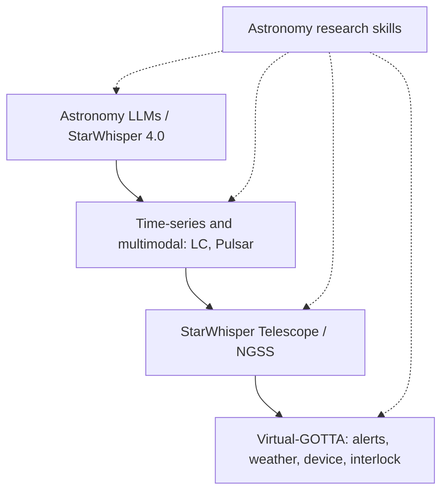

# 星语 / StarWhisper

[](https://github.com/Yu-Yang-Li/StarWhisper/stargazers)
[](LICENSE)
[](https://doi.org/10.1038/s44172-025-00520-4)
[](https://github.com/Yu-Yang-Li/StarWhisper/commits/main)

<p align="center">
  中文 &nbsp;|&nbsp; <a href="README_EN.md">English</a>
</p>

<div align="center">


</div>

**StarWhisper** 是面向天文学的开源模型与智能体项目。它要解决的不是“大模型能不能回答天文问题”，而是：当科学目标、天气和设备状态同时变化时，智能体怎样做可解释、可回放、可拒绝的观测决策，并把文献、数据和写作接到同一条工作流里。

项目由国家天文台、之江实验室等单位支持，已经从语言模型、光变曲线模型和脉冲星模型，推进到 **StarWhisper Telescope** 和 **Virtual-GOTTA**。正式论文见 [Wang et al., *Communications Engineering* 4, 184 (2025)](https://doi.org/10.1038/s44172-025-00520-4)。

| 入口 | 说明 |
| --- | --- |
| [Virtual-GOTTA 路线图](https://yu-yang-li.github.io/StarWhisper/virtual-gotta-map.html) | 具身智能望远镜与暂现源组网的交互说明 |
| [`NGSS/`](NGSS) | StarWhisper Telescope 近邻星系巡天落地代码 |
| [`skills/`](skills/README.md) | 天文强化后的科研技能：检索、假设、写作、引用检查 |
| [论文 DOI](https://doi.org/10.1038/s44172-025-00520-4) | 端到端观测自动化 agent 框架 |

---

## 项目分层

<div align="center">


</div>


```mermaid
flowchart TB
  llm[Astronomy LLMs / StarWhisper 4.0]
  mm[Time-series and multimodal: LC, Pulsar]
  tel[StarWhisper Telescope / NGSS]
  gotta[Virtual-GOTTA: alerts, weather, device, interlock]
  skills[Astronomy research skills]
  llm --> mm --> tel --> gotta
  skills -.-> llm
  skills -.-> mm
  skills -.-> tel
  skills -.-> gotta
```

| 层 | 现在能公开看到的 | 仓库位置 |
| --- | --- | --- |
| 天文学语言模型 | 科普与科研问答、代码、观测知识 | `LLM_Data` |
| 时序 / 多模态 | 光变曲线分类、脉冲星识别 | StarWhisper LC、StarWhisper Pulsar |
| StarWhisper Telescope | 真实巡天里的观测自动化 agent | `NGSS` |
| Virtual-GOTTA | 科学级望远镜的具身改造与组网路线 | `docs/virtual-gotta-map.html` |
| 天文科研技能 | 把文献—假设—数据合同—写作接到 agent 侧 | [`skills/`](skills/README.md) |
| 开放探索环境 | 合成夜次上的可回放决策边界实验 | 下文 *StarWhisper-Explore* |

核心目标是把知识、数据处理、观测计划、设备约束和科学判断接到一套可扩展工作流里，而不是只展示单点模型分数。

---

## 观测决策闭环

夜前计划几乎从不会原样执行。临时科学目标会插入，短时天气会关掉窗口，跟踪、调焦、相机或穹顶也可能突然异常。系统必须连续决定：继续、插入、延后、安全暂停，还是恢复后重规划。

<div align="center">


</div>

<p align="center"><sub>图 1. 既定计划、三类扰动、观测智能体与受约束行动。</sub></p>

这个闭环在真实望远镜网络里已经有端到端自动观测基础（见论文与 `NGSS`）。下面的 Explore 切片回答的是另一件事：**在什么条件下这个判断值得信任，会稳定牺牲什么，何时必须拒绝。**

---

## StarWhisper-Explore：合成环境里的决策边界

环境版本 `StarWhisper-Explore-v0.2`。固定台站 XingLong，单望远镜，一夜六个时隙；候选目标、暂现源到达、天气和设备扰动由种子生成，策略之间共享同一剧本。Agent 不得读取未来扰动，也不得改安全阈值。真实硬件联锁的优先级高于任何建议动作。

这是**合成决策闭环**，用来研究策略，不是光学传播仿真，也不是真实硬件闭环。公开材料不包含望远镜凭据、FTP/MQTT 地址和未脱敏图像。

比较对象预先固定为四类：无干预、随机、确定性优先级、规则 Agent。预注册的正向门槛要求：三个种子均无主动安全违规，无效动作率 ≤ 1%，巡天完成度下降不超过 5 个百分点，同时高价值暂现源跟进率相对提高至少 20%，或综合科学效用提高至少 5%。

当前 90 episode / 策略的合成结果：

| 策略 | 平均科学效用 | 巡天完成度 | 高价值暂现源跟进率 | 无效动作 | 被联锁拦截的危险尝试 |
| --- | ---: | ---: | ---: | ---: | ---: |
| 无干预 | 3.9343 | 77.41% | 0.00% | 0 | 122 |
| 随机 | 2.4027 | 30.19% | 30.37% | 18 | 72 |
| 确定性优先级 | 4.3289 | 61.11% | 49.81% | 0 | 0 |
| 规则 Agent | 4.3996 | 51.67% | 73.33% | 0 | 0 |

<div align="center">


</div>

<p align="center"><sub>图 2. 预注册门槛下的策略权衡：规则 Agent 跟进率最高，但落在巡天完成度允许区左侧。</sub></p>

规则 Agent 相对确定性优先级把跟进率提高了 23.52 个百分点，科学效用只提高约 1.6%，但巡天完成度下降 9.44 个百分点，超过预注册的 5 个百分点容忍线。这是**稳定负结果**：当前边际价值规则过度偏向短期响应。三个种子方向一致，双跑输出哈希一致。它不能写成“Agent 已经赢了”。

<div align="center">


</div>

<p align="center"><sub>图 3. 先证明可复现，再校准现实，最后才进入只建议、不执行的硬件影子运行。</sub></p>

下一步按这条路走：补上 AstroQ / TJO 风格的约束调度 baseline，用脱敏日志校准扰动频率，再把同一决策接口接到观测时序模型、短时气象和控制模型。影子运行仍然是建议，不是放权。

---

## 天文科研技能

<div align="center">


</div>

这些技能改编自 [tashan-research-skills](https://github.com/TashanGKD/tashan-research-skills)，默认值改成了天文学：NASA ADS、arXiv `astro-ph`、AAS 引用、光变/光谱/FITS 数据合同、选择效应，以及“合成 / 回放 / 硬件”三条边界。完整表见 [`skills/README.md`](skills/README.md)。

| 类 | 技能 |
| --- | --- |
| 文献证据 | 论文检索 · 深度研究 · 论文审查 |
| 研究构思 | 假设生成 · 数据处理 · 实验设计 · 统计分析 |
| 成果表达 | 文本润色 · 学术写作 · 科研绘图 · PPT |
| 协作沉淀 | 引用合规 · 科研画像 |

```powershell
git clone https://github.com/Yu-Yang-Li/StarWhisper.git
Copy-Item -Recurse .\StarWhisper\skills\giiisp-paper-search-apis "$env:USERPROFILE\.codex\skills\giiisp-paper-search-apis"
```

没有 ADS / Giiisp 密钥时走 dry-run 或本地回退，不伪造检索命中。技能不能对望远镜下发指令。

---

## 已开源模块与论文

1. **StarWhisper 4.0 数据与训练**  
   StarWhisper 3 训练数据在 `LLM_Data`。4.0 权重计划发布到 ModelScope。

2. **[StarWhisper Pulsar](https://openreview.net/pdf?id=8SKgWpZiDL)**  
   脉冲星识别多模态模型技术报告。

3. **[StarWhisper LC](https://spj.science.org/doi/epdf/10.34133/icomputing.0110)**  
   光变曲线分类。论文相关测试代码已上传。

   <div align="center">


</div>

4. **[StarWhisper Telescope](https://doi.org/10.1038/s44172-025-00520-4)**  
   *Communications Engineering* 4, 184 (2025)。近邻星系巡天中的端到端观测自动化 agent。代码在 `NGSS`。

   <div align="center">


</div>

5. **Virtual-GOTTA / StarWhisper 5.0+**  
   把大模型接到警报、台站状态、观测计划和实时响应。路线图：[interactive map](https://yu-yang-li.github.io/StarWhisper/virtual-gotta-map.html)。

<div align="center">


</div>
<div align="center">


</div>

---

## 司天工程

**司天工程** 计划在国内多个台站部署 54 台 1 米级大视场望远镜，约每 30 分钟完成 1 万平方度的三色巡天，服务于极端爆发、引力波电磁对应体、系外行星和太阳系天体等问题。StarWhisper 是“司天大脑”的一条候选技术路径：把模型、技能和专业工具接到真实观测系统，而不是另做一套只存在于幻灯片上的平台。

<div align="center">


</div>

---

## 使用边界

| 可以说 | 不可以说 |
| --- | --- |
| 论文描述的观测自动化框架已在 NGSS 落地 | 本仓库已经接管真实望远镜的安全联锁 |
| Explore-v0.2 的合成夜次可复现、哈希一致 | 规则 Agent 已经通过正向发现门槛 |
| 技能能辅助 ADS 检索、写作和引用检查 | 技能输出等于已发表结果或已发现暂现源 |
| 影子运行可以给出建议 | 建议已被硬件执行 |

源代码：**Apache-2.0**。`skills/` 中改编自他山科研技能库的部分见 [`skills/NOTICE.md`](skills/NOTICE.md)，遵循 MIT。基础模型权重遵循各自许可证。

---

## 引用

```BibTeX
@article{wang2025starwhisper,
  title={StarWhisper Telescope: an AI framework for automating end-to-end astronomical observations},
  author={Wang, Cunshi and Zhang, Yu and Li, Yuyang and Hu, Xinjie and Mao, Yiming and Chen, Xunhao and Du, Pengliang and Wang, Rui and Wu, Ying and Yang, Hang and Li, Yansong and Wang, Beichuan and Mu, Haiyang and Chen, Xiaohan and He, Shunxuan and Mo, Hao and Zhang, Liyue and Du, Lin and Zhao, Yunning and Tian, Jianfeng and Ge, Liang and Mao, Yongna and Li, Shengming and Wang, Zheng and Lu, Xiaomeng and Zou, Jinhang and Huang, Yang and Sun, Ningchen and Zheng, Jie and He, Min and Bai, Yu and Jin, Junjie and Wu, Hong and Liu, Jifeng},
  journal={Communications Engineering},
  volume={4},
  pages={184},
  year={2025},
  doi={10.1038/s44172-025-00520-4},
  url={https://doi.org/10.1038/s44172-025-00520-4}
}
```

## Star History

[](https://star-history.com/#Yu-Yang-Li/StarWhisper&Date)
