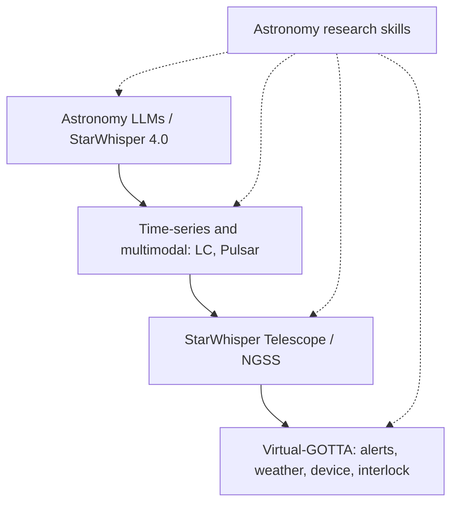

# StarWhisper

[](https://github.com/Yu-Yang-Li/StarWhisper/stargazers)
[](LICENSE)
[](https://doi.org/10.1038/s44172-025-00520-4)
[](https://github.com/Yu-Yang-Li/StarWhisper/commits/main)

<p align="center">
  <a href="README.md">中文</a> &nbsp;|&nbsp; English
</p>

<div align="center">


</div>

**StarWhisper** is an open-source astronomy model-and-agent project. The question is not whether a language model can talk about the sky. It is how an agent should make explainable, replayable, and refusible observing decisions when science targets, weather, and device state change together — and how literature, data, and writing join the same workflow.

Supported by NAOC, Zhejiang Lab, and collaborators, the project moved from language, light-curve, and pulsar models to **StarWhisper Telescope** and **Virtual-GOTTA**. The peer-reviewed paper is [Wang et al., *Communications Engineering* 4, 184 (2025)](https://doi.org/10.1038/s44172-025-00520-4).

| Start here | What it is |
| --- | --- |
| [Virtual-GOTTA map](https://yu-yang-li.github.io/StarWhisper/virtual-gotta-map.html) | Embodied-telescope and transient-network roadmap |
| [`NGSS/`](NGSS) | StarWhisper Telescope code from the nearby-galaxy survey |
| [`skills/`](skills/README.md) | Astronomy-adapted research skills |
| [Paper DOI](https://doi.org/10.1038/s44172-025-00520-4) | End-to-end observing-automation agent |

---

## Layers

<div align="center">


</div>



| Layer | What is public | Where |
| --- | --- | --- |
| Astronomy LLMs | QA, code, observing knowledge | `LLM_Data` |
| Time-series / multimodal | Light-curve classification, pulsar identification | StarWhisper LC, StarWhisper Pulsar |
| StarWhisper Telescope | Observing-automation agent on a real survey | `NGSS` |
| Virtual-GOTTA | Embodied upgrade path for scientific telescopes | `docs/virtual-gotta-map.html` |
| Research skills | Literature, hypotheses, data contracts, writing | [`skills/`](skills/README.md) |
| Open exploration | Replayable decision-boundary experiments | *StarWhisper-Explore* below |

The point is one extensible workflow, not a single model score.

---

## Observing loop

A night plan rarely survives contact with the sky. Targets of opportunity arrive, weather closes windows, and tracking, focus, cameras, or the dome can fail. The system has to choose, repeatedly: continue, insert, defer, pause safely, or recover and replan.

<div align="center">


</div>

<p align="center"><sub>Figure 1. Scheduled plan, three disturbances, observation agent, and constrained actions.</sub></p>

The published telescope stack already demonstrates end-to-end automated observing (paper + `NGSS`). Explore asks a different question: **when is that judgement trustworthy, what does it stably sacrifice, and when must it refuse.**

---

## StarWhisper-Explore: decision boundaries in a synthetic environment

Environment `StarWhisper-Explore-v0.2`. Fixed site XingLong, one telescope, six slots per night. Targets, transient arrivals, weather, and device faults are generated from seeds and shared across policies. The agent cannot read future disturbances or edit safety thresholds. Hardware interlocks outrank any suggested action.

This is a **synthetic decision loop**. It is not optical-propagation physics and not a live hardware loop. Credentials, FTP/MQTT endpoints, and raw images stay private.

Four pre-registered comparators: no-intervention, random, deterministic priority, and a rule agent. A positive finding requires, on all three seeds: no active safety violations, invalid-action rate ≤ 1%, survey-completeness drop ≤ 5 percentage points, and either ≥ 20% relative gain in high-value transient follow-up or ≥ 5% gain in scientific utility.

Current synthetic result (90 episodes / policy):

| Policy | Mean utility | Survey completeness | High-value follow-up | Invalid actions | Unsafe attempts blocked |
| --- | ---: | ---: | ---: | ---: | ---: |
| No intervention | 3.9343 | 77.41% | 0.00% | 0 | 122 |
| Random | 2.4027 | 30.19% | 30.37% | 18 | 72 |
| Deterministic priority | 4.3289 | 61.11% | 49.81% | 0 | 0 |
| Rule agent | 4.3996 | 51.67% | 73.33% | 0 | 0 |

<div align="center">


</div>

<p align="center"><sub>Figure 2. Policy trade-off under the pre-registered completeness floor. The rule agent has the highest follow-up and sits left of the allowed zone.</sub></p>

The rule agent raises follow-up by 23.52 percentage points over deterministic priority, with only ~1.6% more utility, but completeness falls 9.44 points — past the 5-point tolerance. That is a **stable negative result**: the current marginal-value rule overweights short-term response. The direction is the same on three seeds; a second run matched output hashes. It is not a win.

<div align="center">


</div>

<p align="center"><sub>Figure 3. Reproduce first, calibrate against reality, then enter hardware shadow mode (suggest only).</sub></p>

Next: an AstroQ / TJO-style constrained scheduler, de-identified logs to calibrate disturbance rates, then the same decision interface in front of timing, weather, and control models. Shadow mode remains advice, not authority.

---

## Astronomy research skills

<div align="center">


</div>

Thirteen skills adapted from [tashan-research-skills](https://github.com/TashanGKD/tashan-research-skills). Defaults are astronomical: NASA ADS, arXiv `astro-ph`, AAS citations, light-curve / spectrum / FITS contracts, selection effects, and a hard split between synthetic, replay, and hardware. Full matrix: [`skills/README.md`](skills/README.md).

| Group | Skills |
| --- | --- |
| Literature | paper search, deep research, thesis audit |
| Research design | hypothesis generation, baseline builder, experiment design, statistics |
| Communication | humanization, academic writing, scientific figures, decks |
| Collaboration | citation check, research persona |

```powershell
git clone https://github.com/Yu-Yang-Li/StarWhisper.git
Copy-Item -Recurse .\StarWhisper\skills\giiisp-paper-search-apis "$env:USERPROFILE\.codex\skills\giiisp-paper-search-apis"
```

With no ADS / Giiisp token the skill must dry-run or fall back locally. Skills never command a telescope.

---

## Open modules and papers

1. **StarWhisper 4.0 data and training**  
   StarWhisper 3 training data lives in `LLM_Data`. 4.0 weights are planned for ModelScope.

2. **[StarWhisper Pulsar](https://openreview.net/pdf?id=8SKgWpZiDL)**  
   Multimodal pulsar identification.

3. **[StarWhisper LC](https://spj.science.org/doi/epdf/10.34133/icomputing.0110)**  
   Light-curve classification. Test code from the paper is in the repo.

   <div align="center">


</div>

4. **[StarWhisper Telescope](https://doi.org/10.1038/s44172-025-00520-4)**  
   *Communications Engineering* 4, 184 (2025). End-to-end observing automation on the nearby-galaxy survey. Code: `NGSS`.

   <div align="center">


</div>

5. **Virtual-GOTTA / StarWhisper 5.0+**  
   Models connected to alerts, station state, plans, and real-time response. [Interactive map](https://yu-yang-li.github.io/StarWhisper/virtual-gotta-map.html).

<div align="center">


</div>
<div align="center">


</div>

---

## Sitian

**Sitian** plans 54 one-meter-class wide-field telescopes across Chinese sites, covering about 10,000 square degrees in three colors every 30 minutes. Science targets include extreme bursts, gravitational-wave counterparts, exoplanets, and solar-system bodies. StarWhisper is one candidate path for a “Sitian brain”: models, skills, and domain tools on a real observing system — not a slide-only platform.

<div align="center">


</div>

---

## Boundaries

| Fair to say | Not fair to say |
| --- | --- |
| The published observing-automation frame is implemented in NGSS | This repo already owns live hardware interlocks |
| Explore-v0.2 synthetic nights are replayable and hash-stable | The rule agent passed the positive-finding bar |
| Skills can help with ADS search, writing, and citation checks | Skill output is a published result or a discovery |
| Shadow mode may suggest | Suggestions were executed on hardware |

Source code: **Apache-2.0**. Astronomy-adapted skills under [`skills/`](skills/NOTICE.md) keep the upstream MIT license. Base-model weights follow their own licenses.

---

## Citation

```BibTeX
@article{wang2025starwhisper,
  title={StarWhisper Telescope: an AI framework for automating end-to-end astronomical observations},
  author={Wang, Cunshi and Zhang, Yu and Li, Yuyang and Hu, Xinjie and Mao, Yiming and Chen, Xunhao and Du, Pengliang and Wang, Rui and Wu, Ying and Yang, Hang and Li, Yansong and Wang, Beichuan and Mu, Haiyang and Chen, Xiaohan and He, Shunxuan and Mo, Hao and Zhang, Liyue and Du, Lin and Zhao, Yunning and Tian, Jianfeng and Ge, Liang and Mao, Yongna and Li, Shengming and Wang, Zheng and Lu, Xiaomeng and Zou, Jinhang and Huang, Yang and Sun, Ningchen and Zheng, Jie and He, Min and Bai, Yu and Jin, Junjie and Wu, Hong and Liu, Jifeng},
  journal={Communications Engineering},
  volume={4},
  pages={184},
  year={2025},
  doi={10.1038/s44172-025-00520-4},
  url={https://doi.org/10.1038/s44172-025-00520-4}
}
```

## Star History

[](https://star-history.com/#Yu-Yang-Li/StarWhisper&Date)
