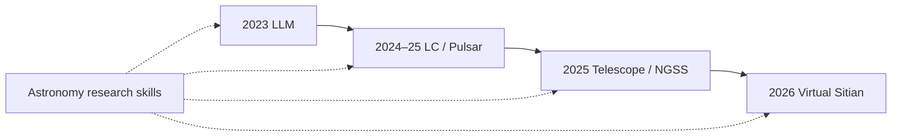

# StarWhisper

[](https://github.com/Yu-Yang-Li/StarWhisper/stargazers)
[](LICENSE)
[](https://doi.org/10.1038/s44172-025-00520-4)
[](https://github.com/Yu-Yang-Li/StarWhisper/commits/main)

<p align="center">
  <a href="README.md">中文</a> &nbsp;|&nbsp; English
</p>

<div align="center">


</div>

StarWhisper is open astronomy work supported by NAOC, Zhejiang Lab, and collaborators. It began in 2023 as a language model, then went on to Kepler / K2 light-curve classification, pulsar candidates, and an observing agent on the Nearby Galaxy Supernovae Survey (NGSS). The 2026 line is Virtual Sitian (SN Clock).

The latest peer-reviewed paper is [StarWhisper Telescope](https://doi.org/10.1038/s44172-025-00520-4) (November 2025). The repo follows that timeline.



| Year | What | Code / weights |
| --- | --- | --- |
| 2023 | repo created; astronomy LLM | [`LLM_Data/`](LLM_Data), [StarWhisper3](https://www.modelscope.cn/models/AstroYuYang/StarWhisper3) |
| 2024 | light-curve classification, pulsars, Telescope preprint | [`StarWhisper_LC/`](StarWhisper_LC), [Pulsar code](https://github.com/ACMISLab/StarWhisper-Pulsar) |
| 2025 | LC and Telescope published | [`NGSS/`](NGSS) |
| 2026 | Virtual Sitian, Explore, astronomy skills | [SitianClaw](https://github.com/Yu-Yang-Li/SitianClaw), [`skills/`](skills/README.md) |

| Looking for | Where | Note |
| --- | --- | --- |
| Observing agent | [`NGSS/`](NGSS) | Code from the paper; needs NINA and related services |
| Light-curve tests | [`StarWhisper_LC/`](StarWhisper_LC) | Test code, not a full training reproduction |
| Skills that run | [`skills/`](skills/README.md) | 4 native working skills plus 13 adapted Tashan skills; dry-run without keys |
| SN Clock table | [`snclock/`](snclock/README.md) | Explosion-age predictions for 22 sources; limited coverage, read the data card |
| Virtual Sitian | [map](https://yu-yang-li.github.io/StarWhisper/virtual-gotta-map.html), [SitianClaw](https://github.com/Yu-Yang-Li/SitianClaw) | The runnable system is not at this repo root |
| Explore numbers | [`explore/`](explore/README.md) | Spec and checked table; environment code is not in this repo yet |

---

## 2023–2024 · Language models

StarWhisper 3 answers astronomy questions and writes code. Training data is in [`LLM_Data/`](LLM_Data); weights are on ModelScope at [AstroYuYang/StarWhisper3](https://www.modelscope.cn/models/AstroYuYang/StarWhisper3). Version 4.0 is still organizing popular-science and research text; weights are meant to go on ModelScope.

---

## 2024–2025 · Light curves and pulsars

[StarWhisper LC](https://spj.science.org/doi/10.34133/icomputing.0110) classifies variable stars on Kepler / K2 light curves, mainly Cepheids, RR Lyrae, and eclipsing binaries. Besides Conv1D–BiLSTM and Swin Transformer, the paper includes an LLM / multimodal / audio series that needs little hand-built feature work, at about 90% accuracy. Preprint April 2024; published in *Intelligent Computing* on 26 February 2025. Test code: [`StarWhisper_LC/`](StarWhisper_LC).

<div align="center">


</div>

In December 2024, [StarWhisper-Pulsar](https://openreview.net/pdf?id=8SKgWpZiDL) was presented at the NeurIPS 2024 FM4Science workshop: pulsar-candidate classification with multimodal large models. Code: [ACMISLab/StarWhisper-Pulsar](https://github.com/ACMISLab/StarWhisper-Pulsar).

---

## 2025 · StarWhisper Telescope

The [paper](https://doi.org/10.1038/s44172-025-00520-4) was a December 2024 preprint and appeared in *Communications Engineering* on 6 November 2025. The observing-automation agent runs on NGSS, a network of about 10 amateur-level telescopes. Code: [`NGSS/`](NGSS).

A night plan rarely survives the night. Targets of opportunity arrive, weather closes windows, and tracking, focus, cameras, or the dome can fail. The system has to choose, repeatedly: continue, insert, defer, pause safely, or recover and replan.

<div align="center">


</div>

<p align="center"><sub>Scheduled plan, three disturbances, observing agent, constrained actions and feedback. This is the decision structure shared by Telescope and Explore. It is not an optical simulation and not a hardware screenshot.</sub></p>

<div align="center">


</div>

---

## 2026 · Virtual Sitian

The runnable Virtual Sitian system is 2026 work (SN Clock). The early science application is the supernova clock: explosion-epoch estimates and young-SN candidates. Public sketch: [Virtual-GOTTA map](https://yu-yang-li.github.io/StarWhisper/virtual-gotta-map.html). Installable skills for the same workflow: [SitianClaw](https://github.com/Yu-Yang-Li/SitianClaw). Real/bogus prototype: [`GOTTA_Prototype/`](GOTTA_Prototype).

[`snclock/`](snclock/README.md) holds one production output: post-explosion ages for 22 TNS sources at their discovery time, given as q16 / q50 / q84 quantiles and split into two tiers by whether the source falls within two days. Only 2 sources are within two days even at the conservative q84. The table covers less than the declared screening window, and most rows did not persist their input snapshot; the data card spells both out. Read it with [`starwhisper-snclock`](skills/starwhisper-snclock/SKILL.md):

```powershell
python .\skills\starwhisper-snclock\scripts\screen_snclock.py rank --top 10
python .\skills\starwhisper-snclock\scripts\screen_snclock.py audit
```

An age estimate is not a spectroscopic classification, and every source in the table is already on TNS, so nothing here is a new discovery.

Sitian plans 54 one-meter-class wide-field telescopes at Chinese sites, covering about 10,000 square degrees in three colors every 30 minutes. StarWhisper is one candidate path for a “Sitian brain”.

<div align="center">


</div>

Also from 2026, but not the Virtual Sitian main line:

- Xinglong all-sky camera [`AllSky-Camera-XL/`](AllSky-Camera-XL): from a full-sky image to a replanned sequence
- Cloud nowcasting with Himawari: private repo on 2022–2025 archived nights; that line closed in August 2026 and is not an operational forecast
- Early classification on sparse ZTF / ATLAS light curves: [`Early Classification from Sparse Light Curves/`](Early%20Classification%20from%20Sparse%20Light%20Curves)
- Low-SNR stellar spectra: [`Low-SNR-Stellar-Spectra-as-Language/`](Low-SNR-Stellar-Spectra-as-Language) ([Jared-web03](https://github.com/Jared-web03/Low-SNR-Stellar-Spectra-as-Language))

---

## 2026 · Explore

Telescope can already observe automatically on a survey. Explore asks when that judgement holds, what it gives up, and when it has to stop.

The spec, action set, and checked table are in [`explore/`](explore/README.md). `StarWhisper-Explore-v0.2` is synthetic: Xinglong, one telescope, six slots per night. The agent cannot see future disturbances or edit safety thresholds. This is not optical-propagation physics, it is not wired to live hardware, and **the environment code is not in this repository yet**.

The comparators were fixed in advance: no intervention, random, deterministic priority, and a rule agent. A positive finding needs all three seeds to pass: no active safety violations, invalid-action rate ≤ 1%, survey-completeness drop ≤ 5 percentage points, and either ≥ 20% relative gain in high-value transient follow-up or ≥ 5% gain in scientific utility.

90 episodes / policy:

| Policy | Mean utility | Survey completeness | High-value follow-up | Invalid actions | Unsafe attempts blocked |
| --- | ---: | ---: | ---: | ---: | ---: |
| No intervention | 3.9343 | 77.41% | 0.00% | 0 | 122 |
| Random | 2.4027 | 30.19% | 30.37% | 18 | 72 |
| Deterministic priority | 4.3289 | 61.11% | 49.81% | 0 | 0 |
| Rule agent | 4.3996 | 51.67% | 73.33% | 0 | 0 |

<div align="center">


</div>

Against deterministic priority, the rule agent raises follow-up by 23.52 percentage points and utility by about 1.6%, while completeness falls 9.44 points — past the 5-point line. Same direction on three seeds; a second run matched hashes. That is a stable negative result: short-term response bought too much survey debt.

You can re-run the verdict, or point it at your own metrics table:

```powershell
python .\skills\starwhisper-explore\scripts\eval_gate.py bar
python .\skills\starwhisper-explore\scripts\eval_gate.py gate --agent rule_agent
```

<div align="center">


</div>

<p align="center"><sub>Reproduce in a synthetic environment first, calibrate on de-identified logs, then hardware shadow mode (suggest only). The public result stops at stage one.</sub></p>

---

## 2026 · Skills

[`skills/`](skills/README.md) holds skills that **do work**, not directory tours: each has decision rules, a runnable script, and regression tests.

| Skill | What it does |
| --- | --- |
| [`starwhisper-snclock`](skills/starwhisper-snclock/SKILL.md) | Screen explosion-age predictions into a shortlist and audit how strong the evidence is |
| [`starwhisper-explore`](skills/starwhisper-explore/SKILL.md) | Judge a policy comparison criterion by criterion against the pre-registered bar |
| [`starwhisper-night-plan`](skills/starwhisper-night-plan/SKILL.md) | Validate observe_config, compute night capacity, lint a target list |
| [`starwhisper-index`](skills/starwhisper-index/SKILL.md) | Decide which skill runs this, or whether the line is reference material only |

Plus 13 astronomy-adapted research skills: search, hypotheses, experiment design, statistics, writing, review, figures.

With no token they dry-run, and they do not invent papers. The night-plan skill only checks; it never calls `/manipulate_nina` or `/ftp_transfer`.

```powershell
powershell -File .\skills\install_native.ps1
python .\skills\starwhisper-night-plan\scripts\plan_night.py budget
python .\skills\giiisp-paper-search-apis\scripts\ads_first_search.py --query "early supernova ZTF" --dry-run
```

---

## Citation

```BibTeX
@article{wang2025starwhisper,
  title={StarWhisper Telescope: an AI framework for automating end-to-end astronomical observations},
  author={Wang, Cunshi and Zhang, Yu and Li, Yuyang and Hu, Xinjie and Mao, Yiming and Chen, Xunhao and Du, Pengliang and Wang, Rui and Wu, Ying and Yang, Hang and Li, Yansong and Wang, Beichuan and Mu, Haiyang and Chen, Xiaohan and He, Shunxuan and Mo, Hao and Zhang, Liyue and Du, Lin and Zhao, Yunning and Tian, Jianfeng and Ge, Liang and Mao, Yongna and Li, Shengming and Wang, Zheng and Lu, Xiaomeng and Zou, Jinhang and Huang, Yang and Sun, Ningchen and Zheng, Jie and He, Min and Bai, Yu and Jin, Junjie and Wu, Hong and Liu, Jifeng},
  journal={Communications Engineering},
  volume={4},
  pages={184},
  year={2025},
  doi={10.1038/s44172-025-00520-4},
  url={https://doi.org/10.1038/s44172-025-00520-4}
}
```

GitHub also reads [`CITATION.cff`](CITATION.cff). Source code is Apache-2.0. The adapted skills under [`NOTICE.md`](skills/NOTICE.md) stay MIT. Model weights follow their own licenses.

## Star History

[](https://star-history.com/#Yu-Yang-Li/StarWhisper&Date)
