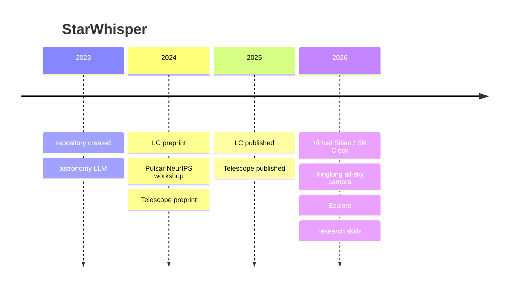

# StarWhisper

[](https://github.com/Yu-Yang-Li/StarWhisper/stargazers)
[](LICENSE)
[](https://doi.org/10.1038/s44172-025-00520-4)
[](https://github.com/Yu-Yang-Li/StarWhisper/commits/main)

<p align="center">
  <a href="README.md">中文</a> &nbsp;|&nbsp; English
</p>

<div align="center">


</div>

**StarWhisper** started as an astronomy language model, then moved through light curves and pulsar candidates into live telescope observing, and in 2026 into Virtual Sitian (SN Clock) and replayable decision-boundary experiments. Supported by NAOC, Zhejiang Lab, and collaborators. The latest peer-reviewed paper is [StarWhisper Telescope](https://doi.org/10.1038/s44172-025-00520-4) (November 2025).

| Start here | Era |
| --- | --- |
| [`LLM_Data/`](LLM_Data) · [ModelScope AstroYuYang](https://www.modelscope.cn/models/AstroYuYang/StarWhisper3) | 2023–2024 language models |
| [`StarWhisper_LC/`](StarWhisper_LC) · [Pulsar code](https://github.com/ACMISLab/StarWhisper-Pulsar) | 2024–2025 time-series and multimodal |
| [`NGSS/`](NGSS) · [Telescope paper](https://doi.org/10.1038/s44172-025-00520-4) | 2025 observing automation |
| [Virtual-GOTTA](https://yu-yang-li.github.io/StarWhisper/virtual-gotta-map.html) · [SitianClaw](https://github.com/Yu-Yang-Li/SitianClaw) | 2026 Virtual Sitian / SN Clock |
| [`AllSky-Camera-XL/`](AllSky-Camera-XL) · [`Low-SNR-Stellar-Spectra-as-Language/`](Low-SNR-Stellar-Spectra-as-Language) | 2026 all-sky camera and spectra |
| Explore below · [`skills/`](skills/README.md) | 2026 decision boundaries and research skills |

Other astronomy repos under Yu-Yang-Li (this page is the map):

| Repo | Visibility | Year | What it is |
| --- | --- | --- | --- |
| This repo `StarWhisper` | public | 2023– | models, Telescope, roadmap, skills |
| [ACMISLab/StarWhisper-Pulsar](https://github.com/ACMISLab/StarWhisper-Pulsar) | public | 2024 | pulsar-candidate code and experiments |
| [AstroYuYang/StarWhisper3](https://www.modelscope.cn/models/AstroYuYang/StarWhisper3) | public | 2023– | StarWhisper 3 weights on ModelScope |
| `tns_project` | private | 2025.07 | TNS / ATLAS / ZTF transient intake |
| [SitianClaw](https://github.com/Yu-Yang-Li/SitianClaw) | public | 2026.03 | SN Clock workflows as installable skills |
| [Jared-web03/Low-SNR-Stellar-Spectra-as-Language](https://github.com/Jared-web03/Low-SNR-Stellar-Spectra-as-Language) | public | 2026.04 | low-SNR stellar spectra; copy in this repo |
| snclock | see that repo | 2026 | Virtual Sitian / SN Clock source |
| `xinglong-cloud-nowcasting-research` | private | 2026.07–08 | Xinglong all-sky camera × Himawari AHI nowcasting; main line closed |

---

## Timeline



| When | Stage | What is public |
| --- | --- | --- |
| 2023.07 | Repository | GitHub `Yu-Yang-Li/StarWhisper` |
| 2023–2024 | Astronomy LLMs | `LLM_Data`; weights [AstroYuYang/StarWhisper3](https://www.modelscope.cn/models/AstroYuYang/StarWhisper3) |
| 2024.04 | Light curves | [arXiv:2404.10757](https://arxiv.org/abs/2404.10757); code in `StarWhisper_LC` |
| 2024.12 | Pulsar candidates | [report](https://openreview.net/pdf?id=8SKgWpZiDL); code [ACMISLab/StarWhisper-Pulsar](https://github.com/ACMISLab/StarWhisper-Pulsar) |
| 2024.12 | Observing-automation preprint | [arXiv:2412.06412](https://arxiv.org/abs/2412.06412) |
| 2025.02 | Light curves published | [Intelligent Computing](https://spj.science.org/doi/10.34133/icomputing.0110) |
| 2025.07 | TNS monitoring | private `tns_project` (TNS / ATLAS / ZTF) |
| 2025.11 | Telescope agent published | [Communications Engineering 4, 184](https://doi.org/10.1038/s44172-025-00520-4); code in `NGSS` |
| 2026.03 | SN Clock skills | [SitianClaw](https://github.com/Yu-Yang-Li/SitianClaw) |
| 2026.04 | Low-SNR spectra | [`Low-SNR-Stellar-Spectra-as-Language/`](Low-SNR-Stellar-Spectra-as-Language) |
| 2026.06 | All-sky replan · GOTTA prototype | [`AllSky-Camera-XL/`](AllSky-Camera-XL), [`GOTTA_Prototype/`](GOTTA_Prototype) |
| 2026.07 | Early sparse-LC classification | [`Early Classification from Sparse Light Curves/`](Early%20Classification%20from%20Sparse%20Light%20Curves) |
| 2026.07–08 | Xinglong cloud nowcasting | private `xinglong-cloud-nowcasting-research` (main line closed) |
| 2026 | Virtual Sitian / SN Clock | snclock repo; public map [Virtual-GOTTA](https://yu-yang-li.github.io/StarWhisper/virtual-gotta-map.html) |
| 2026 | Decision boundary | StarWhisper-Explore-v0.2 (synthetic; stable negative result) |
| 2026.08 | Research skills | [`skills/`](skills/README.md) |

<div align="center">


</div>

<p align="center"><sub>The current surface: models, the telescope agent, Virtual-GOTTA, and research skills on one line — not four disconnected demos.</sub></p>

---

## 2023–2024 · Astronomy language models

The first problem was whether a model could answer astronomy questions, write code, and use observing knowledge. StarWhisper 3 training data is in `LLM_Data`; weights are on ModelScope at [AstroYuYang/StarWhisper3](https://www.modelscope.cn/models/AstroYuYang/StarWhisper3). Version 4.0 continues that data work.

This stage is “does the model know astronomy”. It does not yet talk to a telescope.

---

## 2024–2025 · Light curves and pulsars

The next step was time-series and multimodal data, not only chat.

**April 2024**: [StarWhisper LC](https://arxiv.org/abs/2404.10757) preprint. **26 February 2025**: published in *Intelligent Computing*. Variable-star classification on Kepler / K2 light curves, including LLM / multimodal / audio variants that need less hand-built features. Test code is in the repo.

<div align="center">


</div>

**December 2024**: [StarWhisper-Pulsar](https://openreview.net/pdf?id=8SKgWpZiDL) at the NeurIPS 2024 FM4Science workshop — pulsar-candidate classification with multimodal large models. Code and experiments live in [ACMISLab/StarWhisper-Pulsar](https://github.com/ACMISLab/StarWhisper-Pulsar), not at this repo root.

---

## 2025 · StarWhisper Telescope

Preprint in **December 2024**; published **6 November 2025** in *Communications Engineering*. The [paper](https://doi.org/10.1038/s44172-025-00520-4) describes an end-to-end observing-automation agent on the Nearby Galaxy Supernovae Survey. Code: [`NGSS/`](NGSS).

A night plan rarely survives contact with the sky. Targets of opportunity arrive, weather closes windows, and tracking, focus, cameras, or the dome can fail. The system has to choose, repeatedly: continue, insert, defer, pause safely, or recover and replan.

<div align="center">


</div>

<div align="center">


</div>

<p align="center"><sub>Figure 1. Scheduled plan, three disturbances, observation agent, and constrained actions.</sub></p>

<div align="center">


</div>
<div align="center">


</div>

The same year, in July, the private repo `tns_project` pulls transients from TNS and attaches ATLAS / ZTF photometry. That is later SN Clock intake, not part of the Telescope paper.

This stage shows that an agent can sit on a real survey workflow. It does not yet say when that judgement is trustworthy.

---

## 2026 · Virtual Sitian (SN Clock)

The runnable virtual-Sitian system is 2026 work. Source lives in **snclock** (SN Clock): alerts, station state, observing plans, and data return, with the supernova clock as the early science application. The public sketch in this repo is the [Virtual-GOTTA map](https://yu-yang-li.github.io/StarWhisper/virtual-gotta-map.html). Installable workflow skills are in [SitianClaw](https://github.com/Yu-Yang-Li/SitianClaw) (March 2026). The real/bogus prototype is [`GOTTA_Prototype/`](GOTTA_Prototype).

**Sitian** plans 54 one-meter-class wide-field telescopes across Chinese sites, covering about 10,000 square degrees in three colors every 30 minutes. StarWhisper is one candidate path for a “Sitian brain”. The 2025 Telescope paper is a live-survey observing agent; Virtual Sitian / SN Clock is the following year’s work, not the same milestone.

<div align="center">


</div>

---

## 2026 · All-sky camera, spectra, and sparse light curves

The same year also has astronomy work that is not the Telescope paper:

| When | Entry | What it is |
| --- | --- | --- |
| 2026.04 | [`Low-SNR-Stellar-Spectra-as-Language/`](Low-SNR-Stellar-Spectra-as-Language) | low-SNR stellar spectra as language; sibling repo [Jared-web03/…](https://github.com/Jared-web03/Low-SNR-Stellar-Spectra-as-Language) |
| 2026.06 | [`AllSky-Camera-XL/`](AllSky-Camera-XL) | Xinglong all-sky camera: image → mask → replanned sequence |
| 2026.07 | [`Early Classification from Sparse Light Curves/`](Early%20Classification%20from%20Sparse%20Light%20Curves) | early-classification benchmark on sparse ZTF/ATLAS light curves |
| 2026.07–08 | `xinglong-cloud-nowcasting-research` (private) | Xinglong all-sky camera × Himawari AHI nowcasting. Main line closed 2026-08-17: on 2022–2025 archived nights, camera forecasts at 180/360 min are stably improved; prospective copy on new nights is blocked by the observatory camera source — not a live operational forecast |

---

## 2026 · Decision boundary (StarWhisper-Explore)

The published stack can already run automated observing. Explore asks the next question: **when is that judgement trustworthy, what does it stably sacrifice, and when must it refuse.**

Environment `StarWhisper-Explore-v0.2`. Fixed site XingLong, one telescope, six slots per night. Targets, transient arrivals, weather, and device faults are generated from seeds and shared across policies. The agent cannot read future disturbances or edit safety thresholds. Hardware interlocks outrank any suggested action.

This is a **synthetic decision loop**. It is not optical-propagation physics and not a live hardware loop. Credentials, FTP/MQTT endpoints, and raw images stay private.

Four pre-registered comparators: no-intervention, random, deterministic priority, and a rule agent. A positive finding requires, on all three seeds: no active safety violations, invalid-action rate ≤ 1%, survey-completeness drop ≤ 5 percentage points, and either ≥ 20% relative gain in high-value transient follow-up or ≥ 5% gain in scientific utility.

Current synthetic result (90 episodes / policy):

| Policy | Mean utility | Survey completeness | High-value follow-up | Invalid actions | Unsafe attempts blocked |
| --- | ---: | ---: | ---: | ---: | ---: |
| No intervention | 3.9343 | 77.41% | 0.00% | 0 | 122 |
| Random | 2.4027 | 30.19% | 30.37% | 18 | 72 |
| Deterministic priority | 4.3289 | 61.11% | 49.81% | 0 | 0 |
| Rule agent | 4.3996 | 51.67% | 73.33% | 0 | 0 |

<div align="center">


</div>

<p align="center"><sub>Figure 2. Policy trade-off under the pre-registered completeness floor. The rule agent has the highest follow-up and sits left of the allowed zone.</sub></p>

The rule agent raises follow-up by 23.52 percentage points over deterministic priority, with only ~1.6% more utility, but completeness falls 9.44 points — past the 5-point tolerance. That is a **stable negative result**: the current marginal-value rule overweights short-term response. The direction is the same on three seeds; a second run matched output hashes. It is not a win.

<div align="center">


</div>

<p align="center"><sub>Figure 3. Reproduce first, calibrate against reality, then enter hardware shadow mode (suggest only).</sub></p>

Next: an AstroQ / TJO-style constrained scheduler, de-identified logs to calibrate disturbance rates, then the same decision interface in front of timing, weather, and control models. Shadow mode remains advice, not authority.

---

## 2026 · Astronomy research skills

In August 2026, thirteen skills from [tashan-research-skills](https://github.com/TashanGKD/tashan-research-skills) were adapted for astronomy and placed in [`skills/`](skills/README.md). Defaults are NASA ADS, arXiv `astro-ph`, AAS citations, light-curve / spectrum / FITS contracts, and a hard split between synthetic, replay, and hardware.

<div align="center">


</div>

| Group | Skills |
| --- | --- |
| Literature | paper search, deep research, thesis audit |
| Research design | hypothesis generation, baseline builder, experiment design, statistics |
| Communication | humanization, academic writing, scientific figures, decks |
| Collaboration | citation check, research persona |

```powershell
git clone https://github.com/Yu-Yang-Li/StarWhisper.git
Copy-Item -Recurse .\StarWhisper\skills\giiisp-paper-search-apis "$env:USERPROFILE\.codex\skills\giiisp-paper-search-apis"
```

With no ADS / Giiisp token the skill must dry-run or fall back locally. Skills never command a telescope.

---

## Boundaries

| Fair to say | Not fair to say |
| --- | --- |
| The 2025 observing-automation frame is implemented in NGSS | This repo already owns live hardware interlocks |
| Explore-v0.2 synthetic nights are replayable and hash-stable | The rule agent passed the positive-finding bar |
| Skills can help with ADS search, writing, and citation checks | Skill output is a published result or a discovery |
| Shadow mode may suggest | Suggestions were executed on hardware |

Source code: **Apache-2.0**. Astronomy-adapted skills under [`skills/`](skills/NOTICE.md) keep the upstream MIT license. Base-model weights follow their own licenses.

---

## Citation

If this work is useful, cite the Telescope paper:

```BibTeX
@article{wang2025starwhisper,
  title={StarWhisper Telescope: an AI framework for automating end-to-end astronomical observations},
  author={Wang, Cunshi and Zhang, Yu and Li, Yuyang and Hu, Xinjie and Mao, Yiming and Chen, Xunhao and Du, Pengliang and Wang, Rui and Wu, Ying and Yang, Hang and Li, Yansong and Wang, Beichuan and Mu, Haiyang and Chen, Xiaohan and He, Shunxuan and Mo, Hao and Zhang, Liyue and Du, Lin and Zhao, Yunning and Tian, Jianfeng and Ge, Liang and Mao, Yongna and Li, Shengming and Wang, Zheng and Lu, Xiaomeng and Zou, Jinhang and Huang, Yang and Sun, Ningchen and Zheng, Jie and He, Min and Bai, Yu and Jin, Junjie and Wu, Hong and Liu, Jifeng},
  journal={Communications Engineering},
  volume={4},
  pages={184},
  year={2025},
  doi={10.1038/s44172-025-00520-4},
  url={https://doi.org/10.1038/s44172-025-00520-4}
}
```

## Star History

[](https://star-history.com/#Yu-Yang-Li/StarWhisper&Date)
